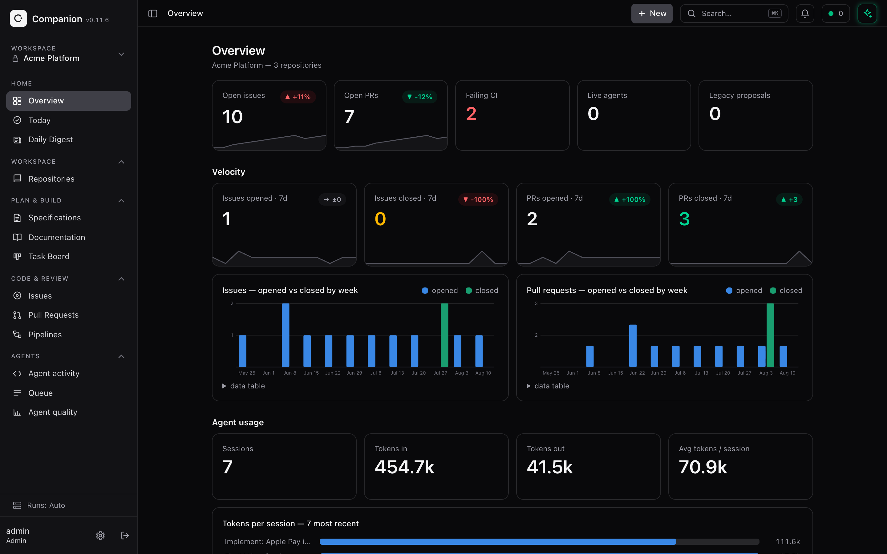
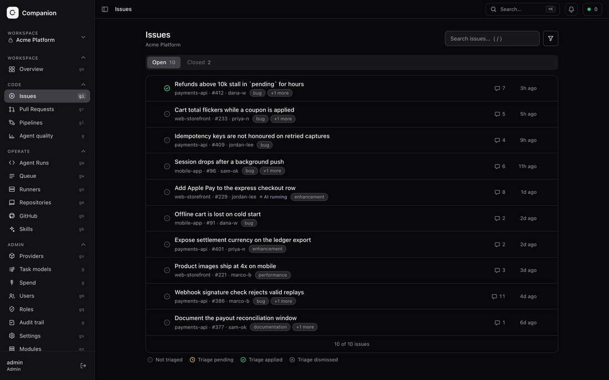
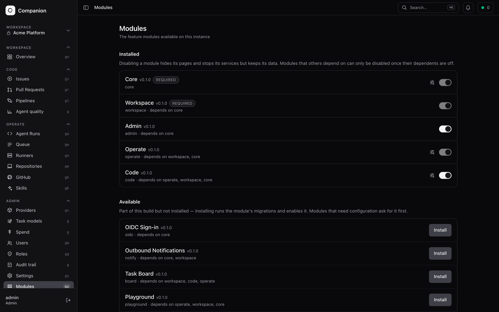

<p align="center">
  <picture>
    <source media="(prefers-color-scheme: dark)" srcset="docs/brand/mark-readme-dark.svg">
    
  </picture>
</p>

<h1 align="center">Companion</h1>

<p align="center">
  A self-hosted engineering dashboard that plugs into GitHub and runs your repositories with AI agents.
</p>

<p align="center">
  <a href="https://www.npmjs.com/package/@moxxy/companion"></a>
  <a href="https://www.npmjs.com/package/@moxxy/companion-sdk"></a>
  
  <a href="LICENSE"></a>
</p>

---

```sh
npx @moxxy/companion
```

That is the whole install. It carries the daemon and the built SPA, sets up an
admin account on first launch, and opens <http://127.0.0.1:8901>. Docker, Coolify
and source builds are in [`docs/install.md`](docs/install.md).

<p align="center">
  
</p>

Agent runs additionally need an agent CLI, which Companion drives as an external
runtime and which holds your model provider credentials rather than Companion
doing so. Three are supported today, chosen per runner machine:

| Harness | Notes |
|---|---|
| [moxxy](https://github.com/moxxy-ai/moxxy) | The fullest set: interactive approvals, and switching model, provider or mode mid-session. |
| [Claude Code](https://claude.com/claude-code) | Policy-based approvals; models come with the CLI. |
| [Codex](https://developers.openai.com/codex) | Policy-based approvals; reports its own model list per session. |

A runner advertises whichever it has installed, so a machine with only Claude
Code is a perfectly good runner. Adding a harness is one descriptor plus a
client, so the list is expected to grow.

## What it does

Everything is scoped to a **workspace**, a named group of repositories.



- **Today** is the front door: one ordered queue of agent changes, AI reviews,
  triage results, failures and merge gates that genuinely need a person.
- **AI Help** reads across the platform, answers in context, drafts complete
  requirements or documentation, and prepares exact actions for your approval.
- **Issues** sync from GitHub, with triage and fix agents on tap.
- **Pull requests** review with CI context, conflict state and review decisions;
  large reviews surface findings shard by shard instead of waiting for the
  whole agent batch.
- **Pipelines** compose typed steps: CI gates, AI review, custom agent runs,
  labels, comments.
- **Ideas, specifications and documentation** turn plain-language needs into
  reviewed planning artifacts and searchable project knowledge.
- **Agent runs** show every run and its lifecycle, live, whichever harness it
  landed on, under a monthly spend ceiling that refuses work rather than
  surprising you.
- **Automations** react to webhooks and schedules, and the inbox can be
  forwarded to Slack, Discord, ntfy or a signed webhook of your own.
- **MCP** exposes the same reads and typed action-preparation catalog to IDE
  agents, while the browser retains final execution authority.

Each of those is a surface you work in rather than a feed you read: an issue
carries its triage verdict, a pull request its CI, its AI review and the
pipeline that gated it, and a run its transcript and the diff it left on a
branch, waiting for you to approve it rather than pushing itself.



Auth and RBAC are built in. Every REST route declares the permission it requires,
the SPA hides what your role cannot use, and roles are instance data rather than
a closed union: see [`docs/permissions.md`](docs/permissions.md).

The menu has five predictable homes: **Home**, **Workspace**, **Plan & build**,
**Code & review**, and **Agents**. The **Business**, **Developer**, and **Admin**
menu views in **Your profile → Navigation** select the relevant homes, while
Admin starts with every area allowed by RBAC. Per-page switches mirror the
selected view and let each person add or remove shortcuts independently in
Business, Developer, and Admin. None of this changes permissions: Search (`⌘K`)
and direct links still reach every permitted page and the few specialist labs.
Enabled modules contribute outcomes to the global **New** menu instead of adding
arbitrary top-level groups. `g` plus a page key jumps directly, `/` focuses
search, and `?` opens optional shortcuts and the product tour.

See [Today, AI Help, and MCP](docs/ai-help-and-mcp.md) for the daily flow, safety
boundary, supported actions, and MCP client configuration.

## How it is built

**A modular framework.** A small kernel (`@moxxy/companion-core`) hosts feature
**modules**, one per domain, that are loaded, migrated, permissioned and toggled
at runtime. Each ships its own tables with rollback, REST and WebSocket routes,
RBAC permissions, background jobs and pages, and declares what it depends on. An
admin can enable, disable or uninstall any non-required module live: its API
flips to `503`, its nav and routes disappear, its permissions drop from the grid,
with no restart.



Modules do not have to live in this repository.
[`@moxxy/companion-sdk`](https://www.npmjs.com/package/@moxxy/companion-sdk) is
the published authoring surface, and `companion module add <spec>` installs one
from any registry.

**Work runs where you put it.** A **runner** is a machine that executes agent
work. The built-in local runner is the machine the daemon runs on; attach as many
remote ones as you like and Companion places each run on an eligible, online,
provider-capable machine, preparing its git worktree there.

## Documentation

| | |
|---|---|
| [Install and deploy](docs/install.md) | npx, Docker, Coolify, pm2 |
| [Configuration](docs/configuration.md) | environment, GitHub Enterprise, proxies |
| [Runners](docs/runners.md) | multi-machine execution |
| [Today, AI Help, and MCP](docs/ai-help-and-mcp.md) | the daily flow and programmatic interface |
| [Operating modules](docs/operating-modules.md) | the module CLI, out-of-tree modules |
| [Permissions and roles](docs/permissions.md) | the RBAC model and its CLI |
| [Development](docs/development.md) | local setup, commands, build profiles |
| [Writing a module](modules/README.md) | the complete authoring guide |
| [Running this for an organisation](ENTERPRISE.md) | roles, audit, deployment shape, and what is not built yet |

## Repository layout

- `apps/api`: the daemon. Boots the kernel, holds the static module registry,
  runs the HTTP and WebSocket server. Feature logic lives in the modules it
  loads, not here.
- `apps/web`: the React SPA **shell**. Hosts and presents modules' client slices;
  it has no feature pages of its own.
- `apps/companion-runner`: the machine-holder agent that lets a remote box
  execute agent work.
- `packages/*`: the framework. `-types` (primitives), `-contracts` (the open
  RBAC, WebSocket and service registries), `-services` (store and service utils),
  `-core` (the kernel, registrant API and client host), `-ui` (the design system),
  `-sdk` (the curated ABI that in-tree and out-of-tree modules both compile
  against).
- `modules/*`: the feature domains, one package each.

## Licence

MIT. See [`LICENSE`](LICENSE).
